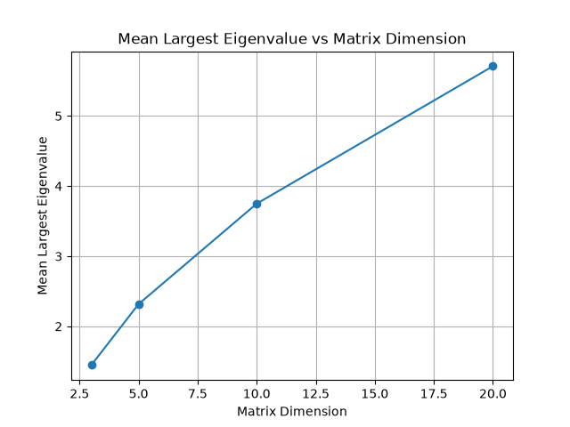
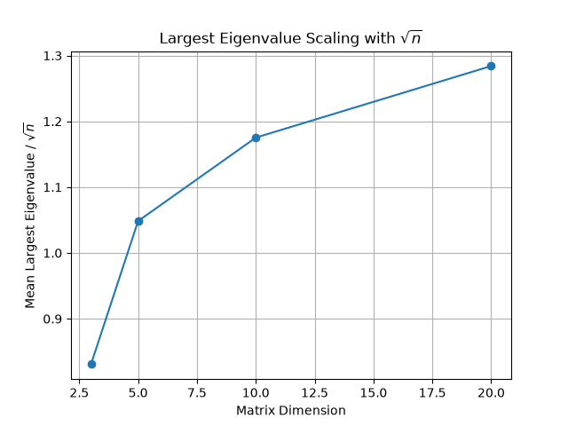
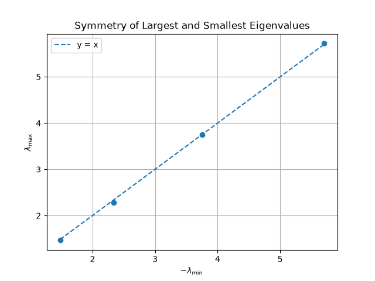

# Exploring Eigenvalues of Random Hermitian Matrices
In this project I will be exploring the relationship between the eigenvalues of randomly generated Hermitian Matrices using Python.
## Objectives
- Generate random Hermitian matrices 
- Calculate their eigenvalues
- Investigate relationships, properties and distribution of the eigenvalues
- Produce figures to visualise the results using Matplotlib
- Analyse and interpret the results
## Experiment 1: Distribution of Eigenvalues
### Research Question
What does the distribution of eigenvalues look like when we repeatedly generate random matrices?
### Method
I generated 1000 random 3x3 Hermitian Matrices using NumPy. For each matrix, I calculated its three eigenvalues using 'numpy.linalg.eigvalsh()'. This produced 3000 eigenvalues which were collected and displayed using a Histogram using Matplotlib. 
### Results
The distribution of the eigenvalues was centred around zero, with the frequency decreasing towards the more positive and negative eigenvalue ends.

Summary:
- Standard Deviation: 1.420
- Mean Eigenvalue: -0.027
- Minimum Eigenvalue: -3.998
- Maximum Eigenvalue: 4.134
### Interpretation
The mean eigenvalue -0.027 is close to zero which indicates that the eigenvalues are centred around zero. This is consistent with the random matrix entries being generated around zero. The minimum and maximum eigenvalues show the range over which the eigenvalues occurred, ranging from -3.998 to 4.134. The distribution was approximately symmetric around zero, with there being fewer eigenvalues at the positive and negative ends. Since the matrices are Hermitian, all the eigenvalues must be real. Therefore, the Histogram provides a way of investigating how real eigenvalues are distributed across many randomly generated matrices. 
### Figure 1

The Histogram shows the frequency of the 3000 eigenvalues generated from the 1000 random 3x3 Hermitian matrices.
## Experiment 2: Effect of Matrix Dimension
### Research Question
How does increasing the dimension of a random Hermitian matrix affect the distribution of its eigenvalues?
### Method
I generated random Hermitian matrices of dimensions 3x3, 5x5, 10x10 and 20x20. For each dimension, 1000 random matrices were generated. The eigenvalues of each matrix were then calculated and collected for analysis. The mean, standard deviation, minimum and maximum eigenvalues were then calculated for each dimension. I produced Histograms to visualise the eigenvalue distributions with probability density used on the y-axis to allow the distributions to be compared.
### Results
| Matrix Dimension | Mean | Standard Deviation | Minimum | Maximum |
|---:|---:|---:|---:|---:|
| 3x3 | -0.0075 | 1.4158 | -3.7582 | 4.0189 | 
| 5x5 | -0.0217 | 1.7261 | -4.6422 | 4.3632 |
| 10x10 | -0.0109 | 2.3462 | -5.8965 | 6.0294 |
| 20x20 | 0.0010 | 3.2443 | -7.4746 | 7.6665 |

### Interpretation 
 Increasing the matrix dimension resulted in an increase in the spread of the eigenvalues. The standard deviation increased from approximately 1.42 for 3x3 matrices to 3.24 for 20x20 matrices. The minimum and maximum eigenvalues also moved further away from zero as the dimension increased. Despite this increase in spread, the mean eigenvalue remained close to zero. This suggests that the eigenvalue distribution remained approximately centred around zero while becoming wider as the matrix dimension increased. The summary plot provides further evidence of this relationship, showing an increasing trend between matrix dimension and the standard deviation of the eigenvalues. Overall, the experiment suggests that increasing the dimension of these randomly generated Hermitian matrices causes their eigenvalues to become more dispersed around zero.
 ## Experiment 3: Largest Eigenvalue and Matrix Dimension
 ### Research Question
 How does the largest eigenvalue of a random Hermitian matrix change as the matrix dimension increases?
 ### Method
 The random Hermitian matrices of dimensions 3x3, 5x5, 10x10 and 20x20 were generated and for each dimension, 1000 random matrices were generated. The eigenvalues were calculated and given in ascending order. This allowed me to calculate the largest eigenvalue using 'eigenvalues[-1]', obtaining the final element in the array. For each matrix dimension, the mean and standard deviation of the largest eigenvalue were calculated. The results were then compared with the square root of the matrix dimension to investigate whether the mean largest eigenvalue appeared to follow a square root relationship.
 ### Results
| Matrix Dimension | Mean Largest Eigenvalue | Standard Deviation | Mean Largest Eigenvalue / $\sqrt{n}$ |
|---:|---:|---:|---:|
| 3x3 | 1.4173 | 0.7878 | 0.8596 |
| 5x5 | 2.3091 | 0.6726 | 1.0410 |
| 10x10 | 3.7214 | 0.6071 | 1.1872 |
| 20x20 | 5.3540 | 0.5640 | 1.2825 |

### Interpretation 
The results show an increase in the mean largest eigenvalue as matrix dimension increases. The mean largest eigenvalue increased from 1.4173 for 3x3 matrices to 5.3540 for 20x20 matrices. The standard deviation of the largest eigenvalue decreased as the matrix dimension increased, from 0.7878 for 3x3 matrices to 0.5640 for 20x20 matrices. This suggests that the largest eigenvalue became less variable as the matrix dimension increased. The relationship between matrix dimension and mean largest eigenvalue was not exactly linear as increasing the dimension from 10x10 to 20x20 doubled it, but the mean largest eigenvalue increased from 3.7214 to only 5.3540. The mean largest eigenvalue was divided by the square root of the dimension and if the largest eigenvalue was proportionate to $\sqrt{n}$, this ratio would be approximately constant. Instead the ratio increased from 0.8596 for dimension 3x3 to 1.2825 for dimension 20x20. Therefore, the results do not establish a simple $\sqrt{n}$ relationship. The increase in the ratio is gradual compared with the increase in matrix dimension, the results suggest that the relationship is sub-linear. A larger range of matrix dimension and more figures would be required to determine the relationship more reliably.

We can conclude that increasing the dimension of the random Hermitian matrices caused the mean largest eigenvalue to increase, while the variability of the largest eigenvalue decreased. The relationship was not linear and the $\sqrt{n}$ comparison suggested that there may be a square root relationship but further investigation is required to establish this.
## Experiment 4: Symmetry of the Smallest and Largest Eigenvalues
### Research Question 
Are the largest and smallest eigenvalues of random Hermitian matrices symmetric around zero?
### Method
For each matric dimension (3x3, 5x5, 10x10, 20x20), 1000 random Hermitian matrices were generated. The smallest and largest eigenvalues were recorded for every matrix. I then calculated the mean smallest and mean largest eigenvalues for each matrix dimension. To investigate symmetry around zero, I calculated $\lambda_{\max}+\lambda_{\min}$. If the largest and smallest eigenvalues are perfectly symmetric around zero, their sum should be equal to zero.
### Results
| Matrix Dimension | Mean Smallest Eigenvalue | Mean Largest Eigenvalue | Mean Symmetry |
|---:|---:|---:|---:|
| 3x3 | -1.4755 | 1.4172 | -0.0584 |
| 5x5 | -2.3072 | 2.2961 | -0.0112 |
| 10x10 | -3.7759 | 3.7596 | -0.0163 |
| 20x20 | -5.7186 | 5.7028 | -0.0158 |

### Interpretation
The results provide strong evidence that the largest and smallest eigenvalues are approximately symmetric around zero. For every matrix dimension investigated, the mean largest eigenvalue was close to the negative of the mean smallest eigenvalue. For example, for 20x20 matrices, the mean smallest eigenvalue was -5.7186 while the mean largest eigenvalues was 5.7028. The mean symmetry values were also close to zero for all four dimensions. The values ranged from -0.0584 for 3x3 matrices to -0.0112 for 5x5 matrices. This indicates that the positive and negative ends of the eigenvalue distribution were closely balanced. The scatter plot provides a visual representation of this relationship. The points lie close to the reference line y=x, where the x-axis represents the negative of the smallest eigenvalue and the y-axis represents the largest eigenvalue. 

The plot indicates that the largest and smallest eigenvalues of the random Hermitian matrices were approximately symmetric around zero across all four matrix dimensions. This is consistent with the earlier experiments with the approximately centred eigenvalue distributions observed.
## Conclusion
This project investigated the behaviour eigenvalues of randomly generated Hermitian matrices using Python and numerical simulation. Overall, the experiments showed that the eigenvalues of the matrices remained approximately centred around zero while their spread increased with matrix dimension. The mean largest eigenvalue also increased with dimension, with the relationship appearing sub-linear over the dimensions investigated. This project has provided practical experience with Python, NumPy, Matplotlib, data visualisation and interpretation. 

