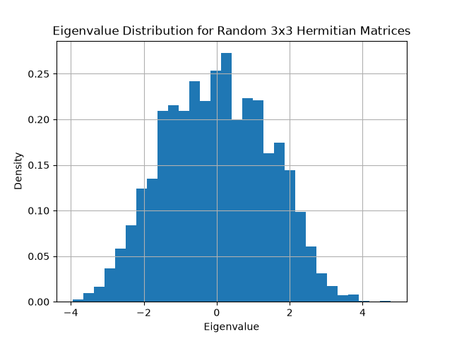
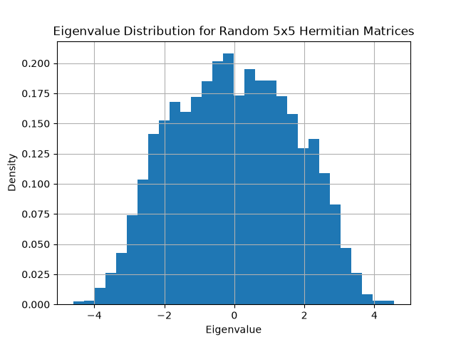
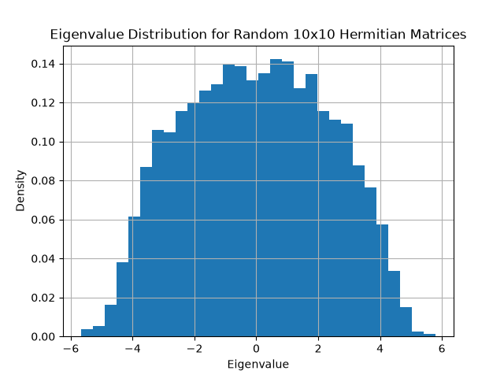
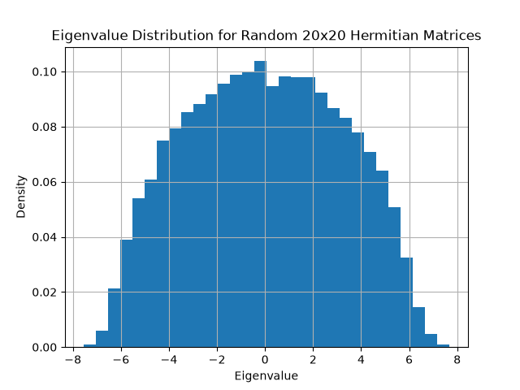
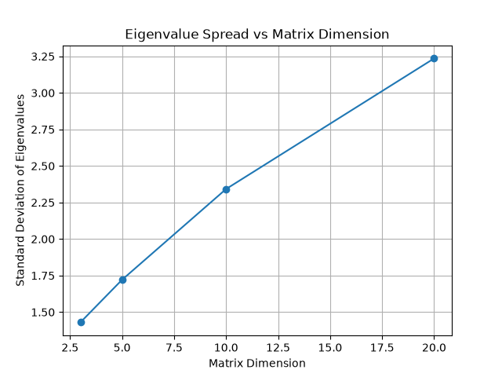

# Exploring Eigenvalues of Random Hermitian Matrices
In this project I will be exploring the relationship between the eigenvalues of randomly generated Hermitian Matrices using Python.
## Objectives
- Generate random Hermitian matrices 
- Calculate their eigenvalues
- Investigate relationships, properties and distribution of the eigenvalues
- Produce figures to visualise the results using Matplotlib
- Analyse and interpret the results
## Experiment 1: Distribution of Eigenvalues
### Research Question
What does the distribution of eigenvalues look like when we repeatedly generate random matrices?
### Method
I generated 1000 random 3x3 Hermitian Matrices using NumPy. For each matrix, I calculated its three eigenvalues using 'numpy.linalg.eigvalsh()'. This produced 3000 eigenvalues which were collected and displayed using a Histogram using Matplotlib. 
### Results
The distribution of the eigenvalues was centred around zero, with the frequency decreasing towards the more positive and negative eigenvalues.

Summary:
- Standard Deviation: 1.420
- Mean Eigenvalue: -0.027
- Minimum Eigenvalue: -3.998
- Maximum Eigenvalue: 4.134
### Interpretation
The mean eigenvalue -0.027 is close to zero which indicates that the eigenvalues are centred around zero. This is consistent with the random matrix entries being generated around zero. The minimum and maximum eigenvalues show the range over which the eigenvalues occurred, ranging from -3.998 to 4.134. The distribution was approximately symmetric around zero, with there being fewer eigenvalues at the positive and negative ends. Since the matrices are Hermitian, all the eiegnvalues must be real. Therefore, the Histogram provides a way of investigating how real eigenvalues are distributed across many randomly generated matrices. 
### Figure 1

The Histogram shows the frequency of the 3000 eigenvalues generated from the 1000 random 3x3 Hermitian matrices.
## Experiment 2: Effect of Matrix Dimension
### Research Question
How does increasing the dimension of a random Hermitian matrix affect the distribution of its eigenvalues?
### Method
I generated random Hermitian matrices of dimensions 3x3, 5x5, 10x10 and 20x20. For each dimension, 1000 random matrices were generated. The eigenvalues of each matrix were then calculated and collected for analysis. The mean, standard deviation, minimum and maximum eigenvalues were then calculated for each dimension. I produced Histograms to visualise the eigenvalue distributions with probability density used on the y-axis to allow the distributions to be compared.
### Results
| Matrix Dimension | Mean | Standard Deviation | Minimum | Maximum |
|---:|---:|---:|---:|---:|
| 3x3 | -0.0075 | 1.4158 | -3.7582 | 4.0189 | 
| 5x5 | -0.0217 | 1.7261 | -4.6422 | 4.3632 |
| 10x10 | -0.0109 | 2.3462 | -5.8965 | 6.0294 |
| 20x20 | 0.0010 | 3.2443 | -7.4746 | 7.6665 |

### Interpretation 
 Increasing the matrix dimension resulted in an increase in the spread of the eigenvalues. The standard deviation increased from approximately 1.42 for 3x3 matrices to 3.24 for 20x20 matrices. The minimum and maximum eigenvalues also moved further away from zero as the dimension increased. Despite this increase in spread, the mean eigenvalue remained close to zero. This suggests that the eigenvalue distribution remained approximately centred around zero while becoming wider as the matrix dimension increased. The summary plot provides further evidence of this relationship, showing an increasing trend between matrix dimension and the standard deviation of the eigenvalues. Overall, the experiment suggests that increasing the dimension of these randomly generated Hermitian matrices causes tehir eigenvalues to become more dispersed around zero.