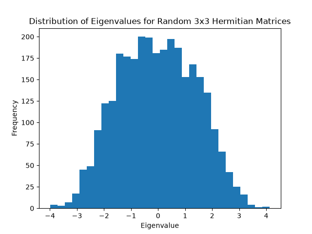

# Exploring Eigenvalues of Random Hermitian Matrices
In this project I will be exploring the relationship between the eigenvalues of randomly generated Hermitian Matrices using Python.
## Objectives
- Generate random Hermitian matrices 
- Calculate their eigenvalues
- Investigate relationships, properties and distribution of the eigenvalues
- Produce figures to visualise the results using Matplotlib
- Analyse and interpret the results
## Experiment 1: Distribution of Eigenvalues
### Research question
What does the distribution of eigenvalues look like when we repeatedly generate random matrices?
### Method
I generated 1000 random 3x3 Hermitian Matrices using NumPy. For each matrix, I calculated its three eigenvalues using 'numpy.linalg.eigvalsh()'. This produced 3000 eigenvalues which were collected and displayed using a Histogram using Matplotlib. 
### Results
The distribution of the eigenvalues was centred around zero, with the frequency decreasing towards the more positive and negative eigenvalues.

Summary:
- Standard Deviation: 1.420
- Mean Eigenvalue: -0.027
- Minimum Eigenvalue: -3.998
- Maximum Eigenvalue: 4.134
### Interpretation
The mean eigenvalue -0.027 is close to zero which indicates that the eigenvalues are centred around zero. This is consistent with the random matrix entries being generated around zero. The minimum and maximum eigenvalues show the range over which the eigenvalues occurred, ranging from -3.998 to 4.134. The distribution was approximately symmetric around zero, with there being fewer eigenvalues at the positive and negative ends. Since the matrices are Hermitian, all the eiegnvalues must be real. Therefore, the Histogram provides a way of investigating how real eigenvalues are distributed across many randomly generated matrices. 
### Figure 1

The Histogram shows the frequency of the 3000 eigenvalues generated from the 1000 random 3x3 Hermitian matrices.
